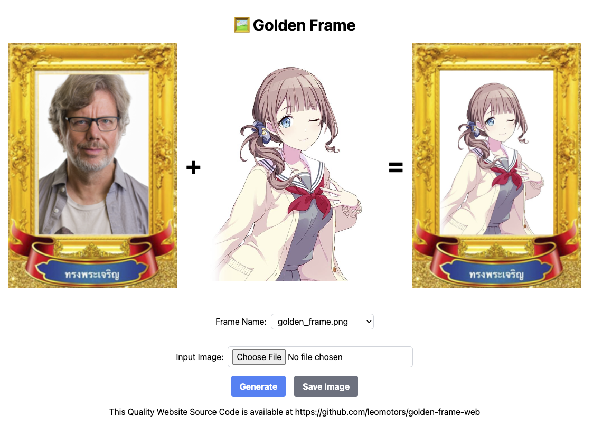

# Golden Frame Website

Live Demo for `pip install golden-frame`



## Stack

Frontend: Astro + Svelte + TailwindCSS (Build Static)  
Backend: Flask (Serve Frontend and API Path)

Library: Golden Frame (https://pypi.org/project/golden-frame)

## Run your own

```
docker pull ghcr.io/leomotors/golden-frame-web:latest
```

## Contribution

Thank you everyone who contributed to [Golden Frame](https://github.com/leomotors/golden-frame)
